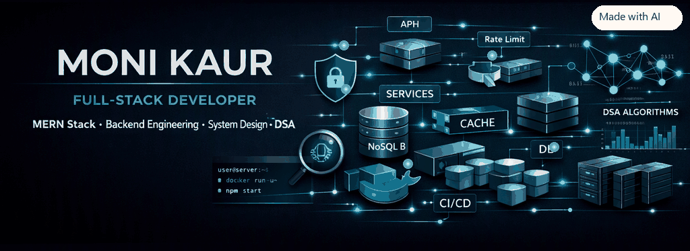
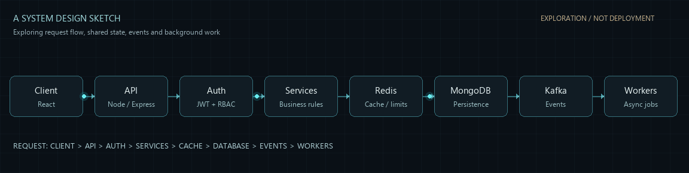
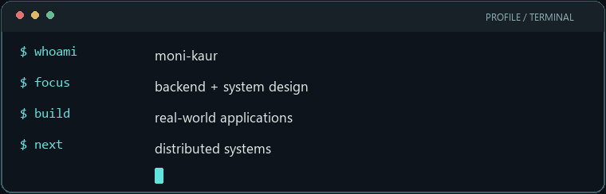

  

   

  

   

  <a href="#featured-projects">Projects</a> &nbsp;·&nbsp;
  <a href="#engineering-focus">Engineering</a> &nbsp;·&nbsp;
  <a href="#problem-solving">DSA</a> &nbsp;·&nbsp;
  <a href="#certifications-and-activities">Certifications</a> &nbsp;·&nbsp;
  <a href="#connect">Connect</a>

 

<table>
  <tr>
    <td width="72%" valign="middle">
      <h2>Hi, I'm Moni.</h2>
      
<strong>Full-stack developer focused on backend engineering and system design.</strong>

      
I build real-world applications with React, Node.js, MongoDB, and Redis. I care about what happens beyond the happy path: safe concurrent writes, clear authorization, recoverable failures, and tests that exercise the rules a product depends on.

      
B.Tech Computer Science &amp; AI · Class of 2028 · CGPA 9.4/10

      
<a href="https://github.com/kaurmoni0013">GitHub</a> &nbsp;·&nbsp; <a href="https://www.linkedin.com/in/kaurmoni0013/">LinkedIn</a> &nbsp;·&nbsp; <a href="https://kaurmoni0013.github.io/Portfolio/">Portfolio</a>

    </td>
    <td width="28%" align="center" valign="middle">
      
       
      Illustrated profile art · AI-generated
    </td>
  </tr>
</table>

## Engineering Focus

| Focus | What that means in my projects |
|:--|:--|
| **Backend engineering** | Designing API routes and services around explicit business rules. |
| **API design** | Building predictable REST endpoints and streaming responses with useful failure behavior. |
| **Data & persistence** | Modeling MongoDB records, using indexes for invariants, and transactions where writes belong together. |
| **Authentication & security** | Applying server-side role and ownership checks, session revocation, input limits, and safe defaults. |
| **Caching & coordination** | Using Redis for rate limits, quotas, short-lived locks, and atomic reservations. |
| **System design** | Exploring how state, traffic, failures, and background work shape a system over time. |

## How I Approach Engineering

  <strong>01 · Understand</strong> &nbsp;→&nbsp;
  <strong>02 · Design</strong> &nbsp;→&nbsp;
  <strong>03 · Build</strong> &nbsp;→&nbsp;
  <strong>04 · Test</strong> &nbsp;→&nbsp;
  <strong>05 · Improve</strong> &nbsp;→&nbsp;
  <strong>06 · Ship</strong>

I prefer learning by building: understand the fundamentals, implement the system, test failure cases, then improve the design. I try to make important product rules explicit—in code, in the database, and in tests.

## Tech Stack

| Category | Tools & concepts |
|:--|:--|
| **Languages** | C++ · Java · JavaScript · TypeScript · SQL |
| **Frontend** | React · React Query · Vite · HTML · CSS |
| **Backend** | Node.js · Express · REST APIs · Server-Sent Events |
| **Data** | MongoDB · Mongoose · Redis |
| **Infrastructure & tools** | Git · GitHub Actions · Docker · Linux · Postman |
| **Engineering concepts** | DSA · OOP · authentication · authorization · API testing · system design |

## Currently Deepening

I use **Redis-backed rate limits, quotas, and coordination** in Orbit AI. I’m now going deeper into the concepts around that work—not presenting every item below as production experience.

  <strong>Backend foundations</strong> &nbsp;→&nbsp;
  <strong>Caching &amp; Redis</strong> &nbsp;→&nbsp;
  <strong>Event-driven systems</strong> &nbsp;→&nbsp;
  <strong>Distributed systems</strong> &nbsp;→&nbsp;
  <strong>Scalable architecture</strong>

**Exploring next:** Kafka and event-driven design · Bloom filters · consistent hashing · caching strategies · distributed systems · CI/CD and deployment.

## Featured Projects

### MediQueue

**Clinic Appointment & Queue Management System** · [Repository](https://github.com/kaurmoni0013/MediQueue) · [Live demo](https://mediqueue-1cu4.onrender.com/login)

A multi-role clinic application that replaces paper registers with appointment booking, a live patient queue, and four role-specific portals.

- **Access control:** server-side role checks and per-record ownership rules for patients, staff, doctors, and administrators.
- **Conflict-safe appointments:** re-check availability at booking time and use a partial unique database index to protect active slots from concurrent bookings.
- **Queue & ETA:** derive queue position and estimated wait from active appointments so the values stay current.
- **Explicit workflow:** enforce `SCHEDULED → WAITING → IN_CONSULT → COMPLETED` transitions, with a separate cancellation path.
- **Testing:** a 67-check end-to-end API suite for authentication, role guards, transitions, rate limits, session revocation, and slot conflicts.

`React` `React Query` `Node.js` `Express` `MongoDB` `Mongoose` `JWT` `Vite`

### Orbit AI

**AI Conversation Workspace** · [Repository](https://github.com/kaurmoni0013/Orbit-AI) · [Live demo](https://orbit-ai-k1m5.onrender.com)

A full-stack chat workspace with persistent conversations, bounded context, streaming responses, and usage controls.

- **Streaming:** deliver generated responses over Server-Sent Events, with timeouts and cancellation when a client disconnects.
- **Safer retries:** idempotency keys replay completed responses instead of making a second provider call.
- **Usage controls:** use Redis for atomic quota reservations, rate limits, summary locks, and reconciliation against reported usage.
- **Consistent persistence:** write a completed message pair and usage totals together in a MongoDB transaction.
- **Account security:** HttpOnly JWT cookies, password hashing, session-version invalidation, logout revocation, and one-time password recovery.

`React` `Node.js` `Express` `MongoDB` `Redis` `OpenRouter` `SSE` `Docker`

## Systems I'm Exploring

This is a **learning diagram**, not a claim that every component is deployed in my projects. It helps me think about where identity, shared state, event processing, and background work fit into a request path.

  

## Problem Solving

I practice data structures and algorithms in **C++**, recording approaches and time/space complexity in my [DSA solutions repository](https://github.com/kaurmoni0013/dsa-cpp).

**Topics:** arrays · strings · linked lists · two pointers · hashing · stacks · monotonic stacks · recursion · backtracking · dynamic programming · graphs · sorting · binary search

[LeetCode](https://leetcode.com/u/kaurmoni0013/) &nbsp;·&nbsp; [GeeksforGeeks](https://www.geeksforgeeks.org/user/kaurmoni0013/)

## Certifications and Activities

| Program / event | Result |
|:--|:--|
| NPTEL · Programming in C++ | Elite |
| NPTEL · Programming in Java | Silver |
| NPTEL · Object-Oriented Programming | Silver |
| NPTEL · Data Structures & Algorithms | Completed |
| HackNexus 2026 | Participant |
| BuildX | Team Epic UI |

## GitHub Activity

These public-repository summaries are a small snapshot; the projects above are a better measure of what I like building.

  
  
   
  

## A Note from the Terminal

  

## Connect

If you enjoy building practical products and thinking through the systems behind them, say hello.

  <a href="https://github.com/kaurmoni0013">GitHub</a> &nbsp;·&nbsp;
  <a href="https://www.linkedin.com/in/kaurmoni0013/">LinkedIn</a> &nbsp;·&nbsp;
  <a href="https://kaurmoni0013.github.io/Portfolio/">Portfolio</a> &nbsp;·&nbsp;
  <a href="mailto:kaurmoni0013@gmail.com">Email</a> &nbsp;·&nbsp;
  <a href="https://leetcode.com/u/kaurmoni0013/">LeetCode</a> &nbsp;·&nbsp;
  <a href="https://www.geeksforgeeks.org/user/kaurmoni0013/">GeeksforGeeks</a>

   
  Build → Break → Learn → Improve

