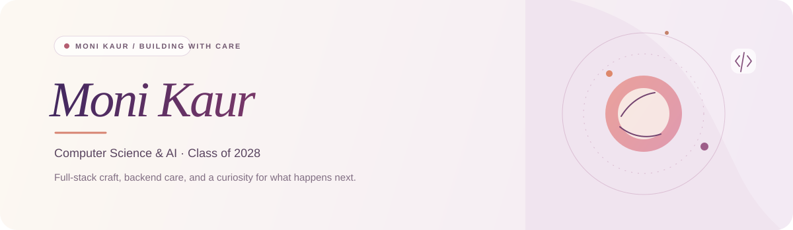

  

   

  

   

  
  
  
  

 

## A little about me

I'm **Moni Kaur**, a Computer Science & AI undergraduate (Class of 2028) who enjoys building full-stack products with a thoughtful backend behind them. I care about the details that make software dependable: clear permissions, safe state transitions, useful tests, and graceful failure.

**B.Tech CSE & AI** · **CGPA 9.4/10** · **C++ / MERN / backend engineering**

## What I do

| Product engineering | Backend engineering |
|:--|:--|
| React interfaces, React Query, and responsive web experiences | REST APIs, authentication, role-based access, and ownership checks |
| End-to-end features from data model to polished UI | Redis-backed limits and coordination, MongoDB persistence, and SSE streaming |
| Docker-based development and CI-backed testing | Transactions, concurrency safeguards, and explicit state machines |

## Selected work

<table>
  <tr>
    <td width="50%" valign="top">
      <h3><a href="https://github.com/kaurmoni0013/Orbit-AI">Orbit AI</a></h3>
      
<strong>AI conversation workspace · MERN + Redis</strong>

      
Streaming conversations with persistent history, bounded context, and usage controls. Built with idempotent retries, atomic quota reservations, and safe handling of disconnected streams.

      
<code>React</code> <code>Express</code> <code>MongoDB</code> <code>Redis</code> <code>SSE</code>

      
<a href="https://orbit-ai-k1m5.onrender.com">Live demo ↗</a>

    </td>
    <td width="50%" valign="top">
      <h3><a href="https://github.com/kaurmoni0013/MediQueue">MediQueue</a></h3>
      
<strong>Clinic appointments & queue management · MERN</strong>

      
A multi-role clinic workflow with race-safe appointment booking, server-enforced permissions, and explicit appointment transitions. Includes end-to-end API checks for the critical paths.

      
<code>React</code> <code>Node.js</code> <code>MongoDB</code> <code>JWT</code> <code>Vitest</code>

      
<a href="https://mediqueue-1cu4.onrender.com/login">Live demo ↗</a>

    </td>
  </tr>
</table>

**More:** [Portfolio](https://kaurmoni0013.github.io/Portfolio/) · [C++ DSA practice](https://github.com/kaurmoni0013/dsa-cpp) · [Solar System](https://github.com/kaurmoni0013/Solar-System)

## Tools I work with

**Languages** &nbsp; `C++` `Java` `JavaScript` `TypeScript` `SQL` 
**Frontend** &nbsp; `React` `React Query` `HTML` `CSS` `Vite` 
**Backend & data** &nbsp; `Node.js` `Express` `MongoDB` `Mongoose` `Redis` `REST` `SSE` 
**Tools & practices** &nbsp; `Git` `Docker` `Linux` `Postman` `CI` `API testing`

## GitHub at a glance

  
  
   
  

## Beyond the code

- **Currently learning:** system design fundamentals, testing strategies, and deployment.
- **Problem solving:** C++ data structures and algorithms, with notes in [dsa-cpp](https://github.com/kaurmoni0013/dsa-cpp).
- **NPTEL:** Programming in C++ — **Elite**; Programming in Java — **Silver**; Object-Oriented Programming — **Silver**.

   
  <strong>Have a project in mind or just want to connect?</strong> 
  <a href="mailto:kaurmoni0013@gmail.com">kaurmoni0013@gmail.com</a> ·
  <a href="https://www.linkedin.com/in/kaurmoni0013">LinkedIn</a> ·
  <a href="https://kaurmoni0013.github.io/Portfolio/">Portfolio</a>

